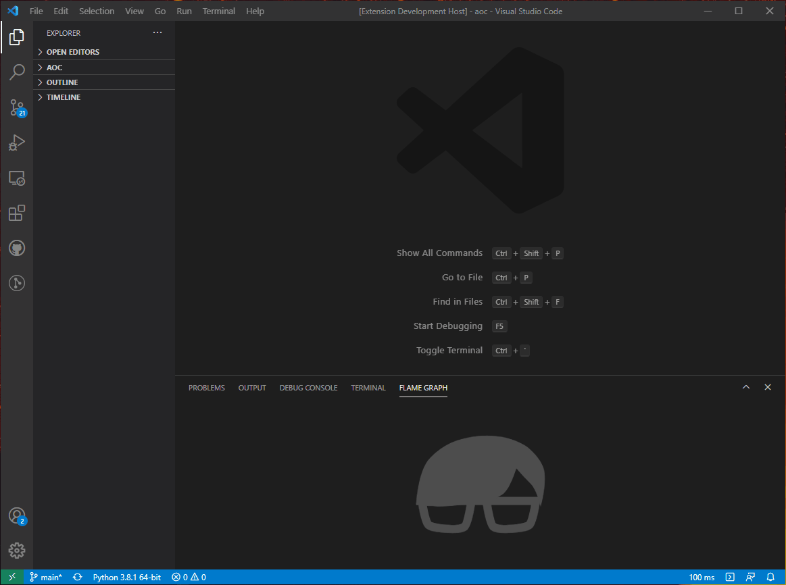

# Austin VS Code Extension

Profile and analyse your Python application inside VS Code using Austin.

    

## Pre-requisites

This extension requires Austin 3. See
[Austin](https://github.com/p403n1x87/austin#installation) for installation
instructions for your platform. If you want to compile from sources or use one
of the available release binaries, you can specify the absolute location of the
Austin binary in the settings.

## Usage

To profile a Python script, open it up in VS Code, open the command palette and
search for `Profile with Austin`. If you already have a file with Austin
samples, open the panel, head to the `FLAME GRAPH` view and click the `OPEN`
button to select the file. Alternatively, once the panel has been revealed,
search for the `Load Austin samples ...` command in the palette.

The flame graph is interactive and when you click on a frame, the corresponding
source will be opened (assuming that all the paths can be resolved correctly) in
VS Code and lines highlighted based on the amount of time spent on them.

## Configuration

Whenver you have an active Python script, the sampling interval and mode
selector will appear  on the status bar. Select between wall-clock time and CPU
time sampling, and the sampling interval in microseconds.
